# Architecture de l'Interpréteur GLaDOS

**Projet B-FUN-500 – GLaDOS**  
*Interpréteur Lisp en Haskell*

---

## Table des Matières

1. [Aperçu Général](#i-aperçu-général)
2. [Modules et Composants](#ii-modules-et-composants)
3. [Diagrammes d'Architecture](#iii-diagrammes-darchitecture)
4. [Flux d'Exécution](#iv-flux-dexécution)
5. [Notes sur l'Architecture Haskell](#v-notes-sur-larchitecture-haskell)
6. [Considérations de Conception](#vi-considérations-de-conception)

---

## I. Aperçu Général

### 1.1 Vue d'Ensemble du Projet

GLaDOS est un **interpréteur de langage Lisp** implémenté en Haskell qui suit le paradigme fonctionnel pur. Le projet transforme du code source Lisp (S-expressions) en résultats exécutés via un pipeline classique d'interprétation :

```
Code Source → Parsing → AST → Évaluation → Résultat
```

### 1.2 Principes de Conception

L'architecture repose sur plusieurs principes fondamentaux :

- **Séparation des préoccupations** : Chaque module a une responsabilité unique et bien définie
- **Immutabilité** : Les structures de données sont immuables (paradigme fonctionnel Haskell)
- **Gestion d'erreurs explicite** : Utilisation du type `Either String a` pour la propagation d'erreurs
- **Portée lexicale** : L'environnement capture les variables selon les règles de scoping du Lisp
- **Extensibilité** : Architecture modulaire permettant l'ajout facile de nouvelles fonctions

### 1.3 Caractéristiques Principales

- **Parsing de S-expressions** : Analyse syntaxique des expressions Lisp
- **Évaluation paresseuse** : Profite de la nature lazy de Haskell
- **Support des fonctions natives** : Opérations arithmétiques, comparaisons, manipulation de listes
- **Lambdas et closures** : Fonctions anonymes avec capture d'environnement
- **Récursion** : Support complet incluant la récursion auto-référentielle
- **Formes spéciales** : `if`, `define`, `lambda`, `quote`

---

## II. Modules et Composants

### 2.1 Vue d'Ensemble des Modules

Le projet est structuré en **6 modules principaux** :

| Module | Fichier | Responsabilité |
|--------|---------|----------------|
| **Types** | `src/Types.hs` | Définition des types de données centraux (AST, Environnement) |
| **Parser** | `src/Parser.hs` | Analyse syntaxique du code source Lisp |
| **Eval** | `src/Eval.hs` | Moteur d'évaluation des expressions |
| **Env** | `src/Env.hs` | Gestion de l'environnement et des bindings |
| **Builtins** | `src/Builtins.hs` | Fonctions natives prédéfinies |
| **Main** | `app/Main.hs` | Point d'entrée et orchestration |

---

### 2.2 Module Types (`src/Types.hs`)

**Rôle** : Définit l'AST (Abstract Syntax Tree) et les types fondamentaux.

#### Types Principaux

```haskell
data LispValue
    = Atom String              -- Symboles/identifiants
    | Number Integer           -- Entiers
    | String String            -- Chaînes de caractères
    | Boolean Bool             -- Booléens (#t, #f)
    | List [LispValue]         -- Listes/appels de fonctions
    | Function LispFunction    -- Valeurs fonctionnelles
    | Nil                      -- Liste vide

data LispFunction
    = BuiltinFunction String ([LispValue] -> Either String LispValue)
    | UserFunction [String] LispValue Env
    | RecursiveFunction String [String] LispValue Env
    | SpecialForm String ([LispValue] -> Either String LispValue)

data Env = Env {
    bindings :: [(String, LispValue)],
    parent :: Maybe Env
}
```

#### Responsabilités

- **Représentation de l'AST** : `LispValue` représente tous les types de valeurs Lisp
- **Types de fonctions** :
  - `BuiltinFunction` : Fonctions natives (implémentées en Haskell)
  - `UserFunction` : Fonctions définies par l'utilisateur (lambdas)
  - `RecursiveFunction` : Fonctions récursives avec auto-référence
  - `SpecialForm` : Formes spéciales évaluées différemment
- **Environnement** : Structure chaînée pour le scoping lexical
- **Type Helpers** : Prédicats de vérification de types (`isAtom`, `isNumber`, etc.)

#### Points Clés

- `LispValue` est au cœur de tout le système
- L'environnement `Env` utilise une liste chaînée de scopes (parent optionnel)
- Les fonctions capturent leur environnement (closures)

---

### 2.3 Module Parser (`src/Parser.hs`)

**Rôle** : Transforme le code source texte en AST (`LispValue`).

#### Architecture du Parser

Le module implémente un **parser combinator** monadic :

```haskell
data Parser a = Parser {
    runParser :: String -> Either ParserError (a, String)
}
```

#### Instances de Type Classes

- `Functor` : Transformation des résultats
- `Applicative` : Combinaison de parsers
- `Alternative` : Choix entre parsers (`<|>`)
- `Monad` : Séquençage et binding

#### Parsers Principaux

| Parser | Description |
|--------|-------------|
| `parseLispValue` | Point d'entrée générique |
| `parseAtom` | Symboles et identifiants |
| `parseNumber` | Entiers (positifs/négatifs) |
| `parseString` | Chaînes entre guillemets |
| `parseBoolean` | `#t` et `#f` |
| `parseList` | S-expressions `(...)` |
| `parseWhitespace` | Espaces et commentaires |
| `parseComment` | Commentaires `;` |

#### Gestion des Erreurs

```haskell
data ParserError
    = PError ParseError        -- Erreurs de syntaxe
    | SError SemanticError     -- Erreurs sémantiques
    | RError RuntimeError      -- Erreurs d'exécution
    | GenericError String      -- Erreurs génériques
```

Chaque erreur peut inclure une `SourceLocation` pour le débogage.

#### Points Clés

- Parser récursif descendant
- Gestion robuste des espaces et commentaires
- Accumulation d'erreurs contextuelles
- Support des nombres négatifs et strings échappés

---

### 2.4 Module Eval (`src/Eval.hs`)

**Rôle** : Cœur de l'interpréteur - évalue l'AST selon les règles sémantiques du Lisp.

#### Fonction Principale

```haskell
eval :: LispValue -> Env -> Either String (LispValue, Env)
```

**Signature** : Prend une expression et un environnement, retourne un résultat et un nouvel environnement.

#### Règles d'Évaluation

| Expression | Comportement |
|------------|--------------|
| **Literals** | `Number`, `Boolean`, `String` → retournés tels quels |
| **Atom** | Lookup dans l'environnement → variable ou fonction |
| **List vide** | `()` → `Nil` |
| **Formes spéciales** | Évaluation spéciale selon la forme |
| **Application** | Évaluation de fonction avec arguments |

#### Formes Spéciales

```haskell
-- Conditionnel
(if condition then-expr else-expr)

-- Définition de variable
(define name expr)

-- Définition de fonction (syntaxe sucrée)
(define (name params...) body)

-- Lambda
(lambda (params...) body)

-- Quote (pas d'évaluation)
(quote expr)
```

#### Application de Fonctions

```haskell
evalApplication :: LispValue -> [LispValue] -> Env 
                -> Either String (LispValue, Env)
```

Gère :
1. **Builtins** : Évalue les arguments puis appelle la fonction native
2. **UserFunction** : Crée un nouveau scope avec les paramètres liés
3. **RecursiveFunction** : Inclut la fonction elle-même dans le scope
4. **Vérification d'arité** : S'assure que le nombre d'arguments est correct

#### Détection de Récursion

```haskell
containsReference :: String -> LispValue -> Bool
```

Analyse statique du corps de fonction pour détecter l'auto-référence.

#### Points Clés

- Évaluation stricte des arguments (call-by-value)
- Environnements capturés pour les closures
- Support de la récursion via `RecursiveFunction`
- Propagation d'erreurs via `Either`

---

### 2.5 Module Env (`src/Env.hs`)

**Rôle** : Gestion de l'environnement d'exécution et des bindings de variables.

#### Structure de l'Environnement

```haskell
data Env = Env {
    bindings :: [(String, LispValue)],  -- Bindings locaux
    parent :: Maybe Env                 -- Scope parent (chaînage)
}
```

**Modèle** : Chaîne de scopes avec recherche récursive vers le parent.

#### Fonctions Principales

| Fonction | Description |
|----------|-------------|
| `emptyEnv` | Crée un environnement vide |
| `lookupVar` | Recherche une variable dans la chaîne de scopes |
| `bindVar` | Ajoute un binding au scope actuel |
| `extendEnv` | Ajoute plusieurs bindings |
| `newScope` | Crée un scope enfant vide |
| `newScopeWith` | Crée un scope enfant avec bindings initiaux |
| `isDefined` | Vérifie l'existence d'une variable |

#### Algorithme de Lookup

```
lookupVar "x" env:
1. Chercher "x" dans env.bindings
2. Si trouvé → retourner la valeur
3. Sinon, si env.parent existe → lookupVar "x" parent
4. Sinon → Nothing (variable non définie)
```

#### Scoping Lexical

```lisp
(define x 10)           ; x défini dans scope global
(define (f y)           ; f crée un nouveau scope
  (+ x y))              ; x est résolu dans le scope parent
(f 5)                   ; retourne 15
```

#### Points Clés

- Scoping lexical (statique)
- Immutabilité : `bindVar` retourne un **nouvel** environnement
- Shadowing : Les bindings locaux masquent les parents
- Performance : O(n) pour lookup, mais n généralement petit

---

### 2.6 Module Builtins (`src/Builtins.hs`)

**Rôle** : Bibliothèque standard avec fonctions natives pré-implémentées.

#### Architecture

```haskell
builtinEnv :: Env
```

Environnement global pré-peuplé avec toutes les fonctions natives.

#### Catégories de Fonctions

##### 1. Opérations Arithmétiques

| Fonction | Signature | Description |
|----------|-----------|-------------|
| `+` | `[Number] -> Number` | Addition |
| `-` | `[Number] -> Number` | Soustraction |
| `*` | `[Number] -> Number` | Multiplication |
| `/` | `[Number] -> Number` | Division (détection division par zéro) |

##### 2. Comparaisons

| Fonction | Description |
|----------|-------------|
| `=` | Égalité (fonctionne sur tous types) |
| `<` | Inférieur strict |
| `>` | Supérieur strict |
| `<=` | Inférieur ou égal |
| `>=` | Supérieur ou égal |

##### 3. Manipulation de Listes

| Fonction | Description |
|----------|-------------|
| `car` | Premier élément (`head`) |
| `cdr` | Reste de la liste (`tail`) |
| `cons` | Construction de liste |
| `list` | Crée une liste à partir d'arguments |

##### 4. Prédicats de Types

| Fonction | Vérifie |
|----------|---------|
| `null?` | Liste vide |
| `number?` | Type numérique |
| `list?` | Type liste |
| `atom?` | Type atome |

#### Implémentation Type

```haskell
type BuiltinFunc = [LispValue] -> Either String LispValue
```

Chaque builtin :
- Prend une liste d'arguments évalués
- Retourne soit une erreur, soit un résultat

#### Exemple d'Implémentation

```haskell
addBuiltin :: [LispValue] -> Either String LispValue
addBuiltin [] = Right (Number 0)
addBuiltin args = Number . sum <$> mapM extractNumber args
```

#### Points Clés

- Toutes les builtins sont enregistrées dans `builtinEnv`
- Validation stricte des arguments (types et arité)
- Messages d'erreur explicites
- Variadic functions supportées (ex: `+` avec 0..n arguments)

---

### 2.7 Module Main (`app/Main.hs`)

**Rôle** : Point d'entrée de l'application, orchestration du pipeline.

#### Flux Principal

```haskell
main :: IO ()
main = do
    input <- getContents
    case parseMultipleExpressions input of
        Left parseErr -> putStrLn $ "Parse Error: " ++ show parseErr
        Right expressions -> do
            evaluateExpressions expressions builtinEnv
            return ()
```

#### Étapes

1. **Lecture** : `getContents` lit depuis stdin
2. **Parsing** : `parseMultipleExpressions` → `[LispValue]`
3. **Évaluation** : `evaluateExpressions` évalue séquentiellement
4. **Affichage** : Chaque résultat est affiché

#### Gestion Multi-Expressions

```haskell
evaluateExpressions :: [LispValue] -> Env -> IO (Maybe LispValue, Env)
```

- Évalue les expressions dans l'ordre
- Propage l'environnement entre expressions (les `define` persistent)
- Affiche chaque résultat intermédiaire
- S'arrête à la première erreur

#### Format d'Affichage

```haskell
showResult :: LispValue -> String
```

Convertit les valeurs Lisp en représentation textuelle :
- `Number 42` → `"42"`
- `Boolean True` → `"#t"`
- `List [...]` → `"(...)"`
- `Function` → `"<function:...>"`

#### Points Clés

- Interface entre le monde pur (évaluation) et IO
- Gestion d'erreurs en deux phases (parsing puis évaluation)
- Support de REPL-like (expressions multiples)
- Code retour 84 en cas d'erreur (spec Epitech)

---

## III. Diagrammes d'Architecture

### 3.1 Diagramme de Modules et Dépendances

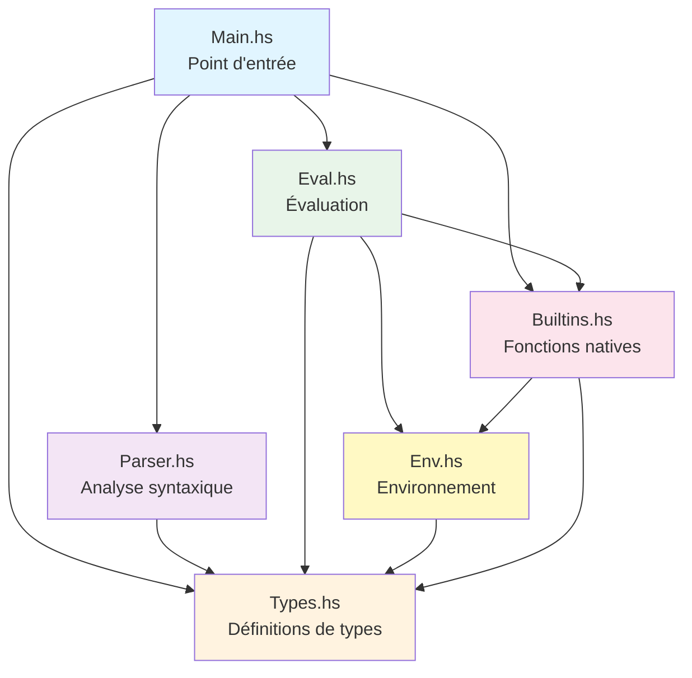

**Légende** :
- **Main** : Couche d'orchestration IO
- **Types** : Fondation (pas de dépendances)
- **Parser** : Ne dépend que de Types
- **Env** : Gestion d'état isolée
- **Builtins** : Utilise Env pour l'initialisation
- **Eval** : Cœur logique, utilise tous les autres

---

### 3.2 Diagramme d'Architecture en Couches

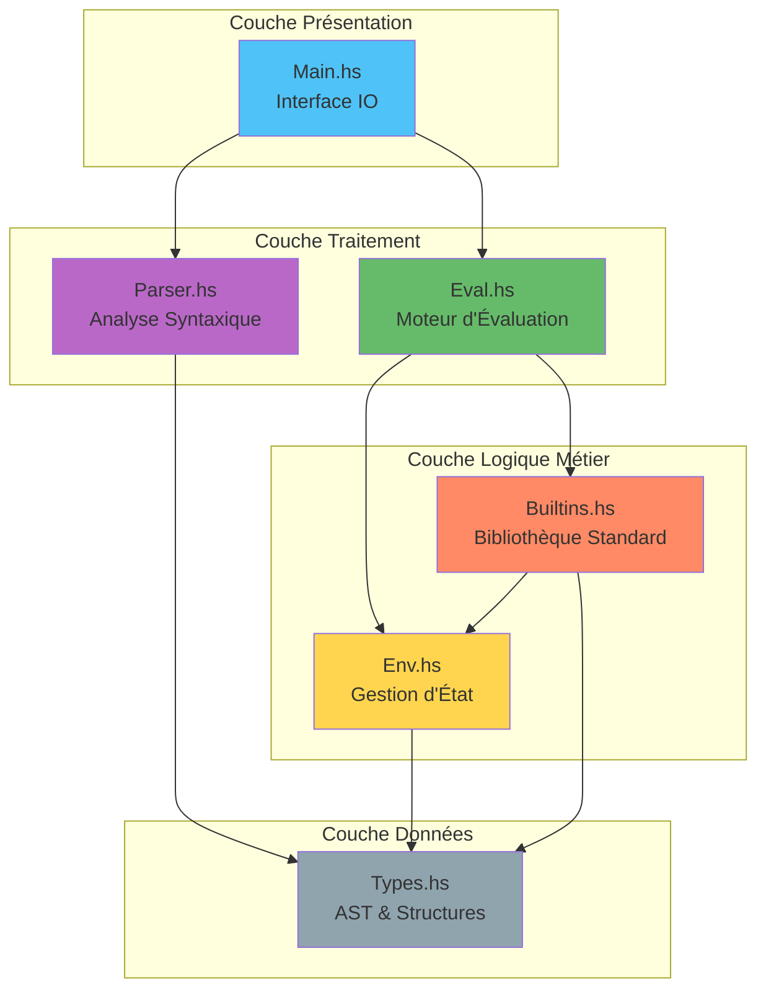

**Principe** : Séparation claire en 4 couches avec flux descendant.

---

### 3.3 Diagramme de Flux de Données (Pipeline d'Exécution)

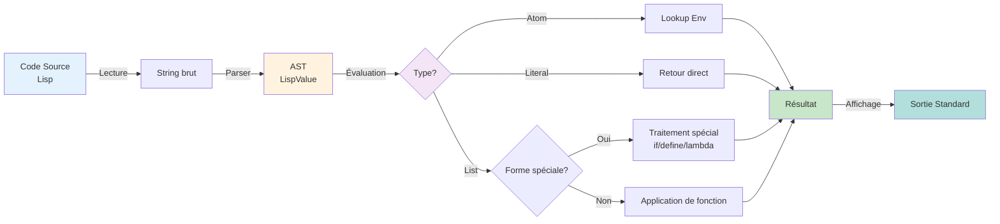

---

### 3.4 Diagramme de Séquence : Évaluation d'une Expression

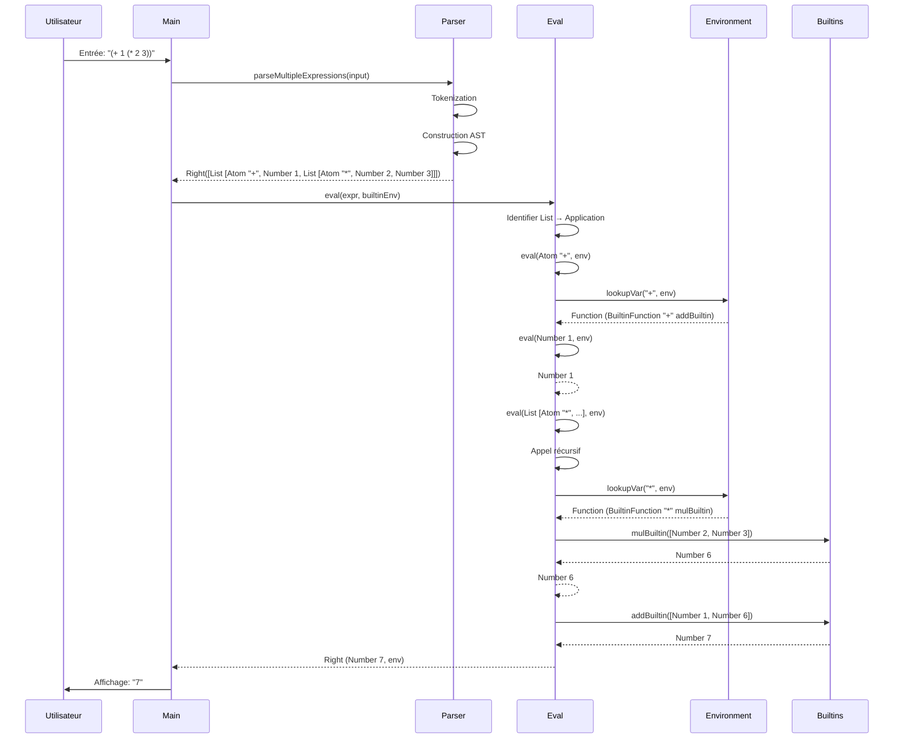

---

### 3.5 Diagramme de Structure : LispValue et LispFunction

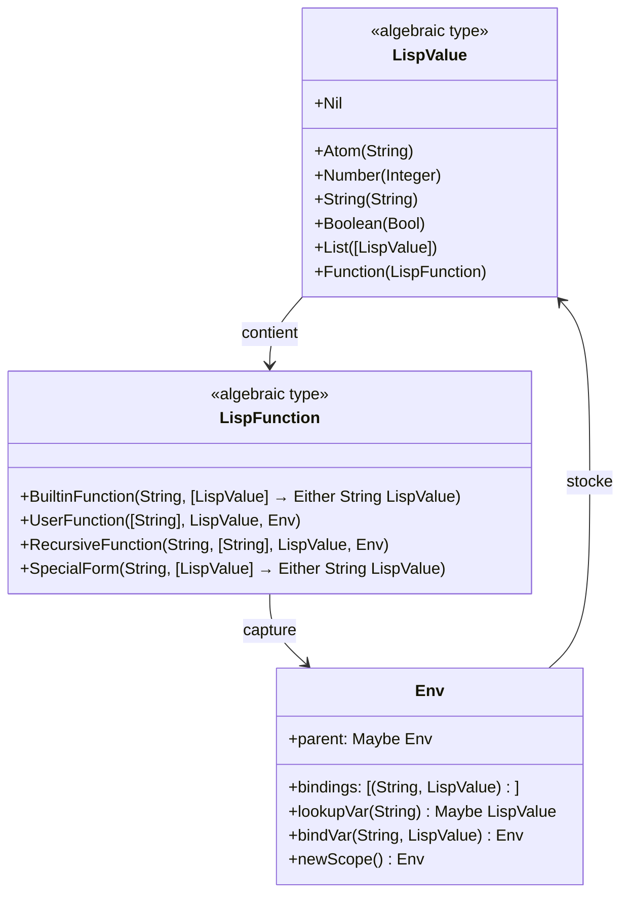

---

### 3.6 Diagramme de Flux : Résolution de Scope

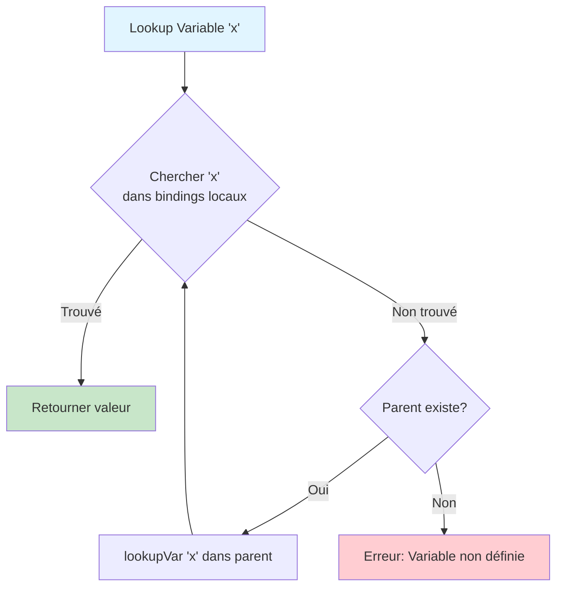

**Exemple** :
```lisp
(define x 10)          ; Scope global
(define (f y)          ; Nouveau scope
  (define z (+ x y))   ; x recherché → scope parent
  z)
```

---

### 3.7 Diagramme d'État : Évaluation d'une Expression

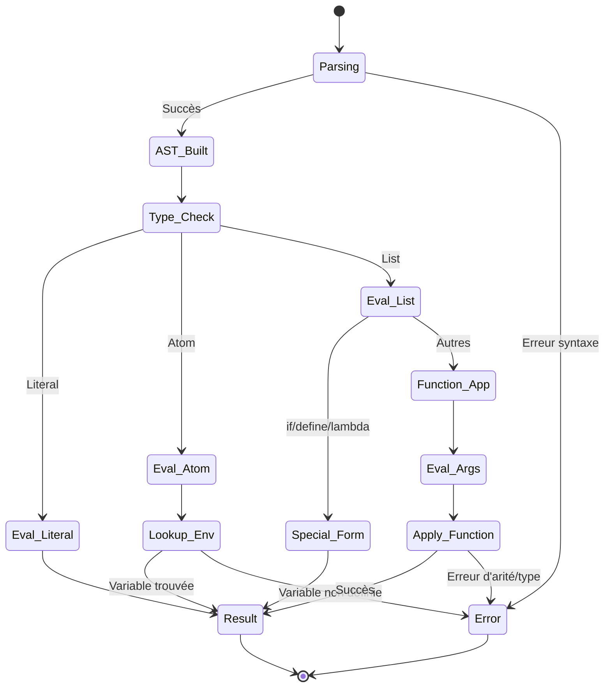

---

## IV. Flux d'Exécution

### 4.1 Pipeline Complet : De la Source au Résultat


#### Exemple Détaillé

**Input** :
```lisp
(define (factorial n)
  (if (= n 0)
      1
      (* n (factorial (- n 1)))))
(factorial 5)
```

**Étape 1 : Parsing** →
```haskell
[ List [Atom "define", 
        List [Atom "factorial", Atom "n"],
        List [Atom "if", 
              List [Atom "=", Atom "n", Number 0],
              Number 1,
              List [Atom "*", Atom "n", 
                    List [Atom "factorial", 
                          List [Atom "-", Atom "n", Number 1]]]]]
, List [Atom "factorial", Number 5]
]
```

**Étape 2 : Évaluation de `define`** →
- Détection de récursion (`containsReference "factorial"`)
- Création de `RecursiveFunction "factorial" ["n"] <body> <env>`
- Binding dans l'environnement : `("factorial", Function <recursive>)`

**Étape 3 : Évaluation de `(factorial 5)`** →
- Lookup de `factorial` → `RecursiveFunction`
- Création de scope avec `("n", Number 5)` et self-reference
- Évaluation récursive du corps
- Résultat final : `Number 120`

**Output** :
```
=> (define (factorial n) ...)
<recursive-function:factorial:(n)>
=> (factorial 5)
120
```

---

### 4.2 Traitement d'un `define` de Fonction

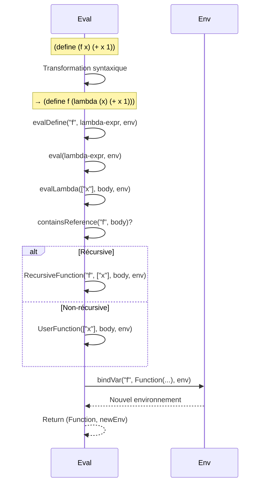

---

### 4.3 Application de Fonction Utilisateur

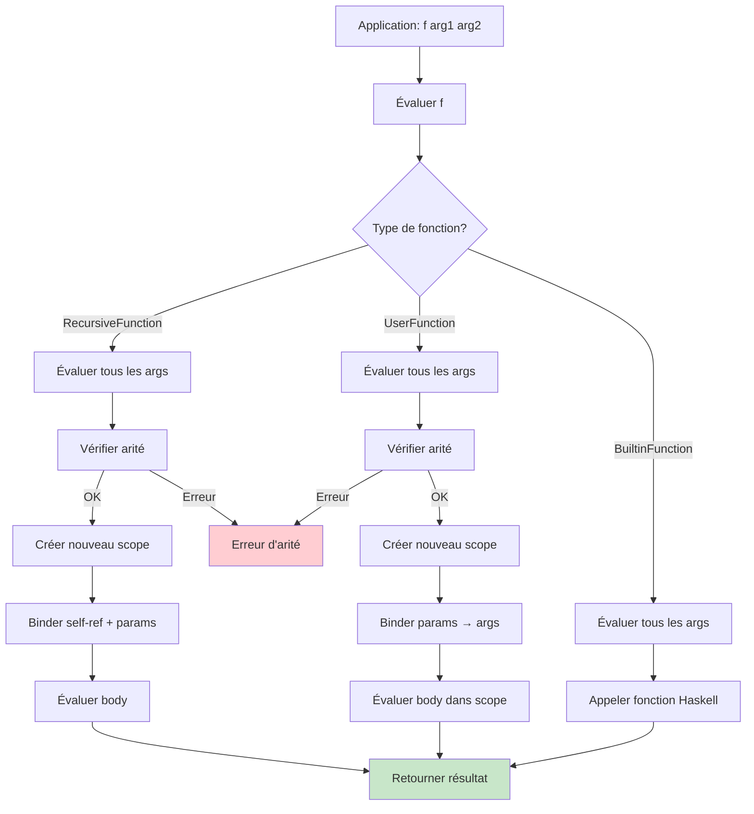

---

### 4.4 Évaluation d'un `if`

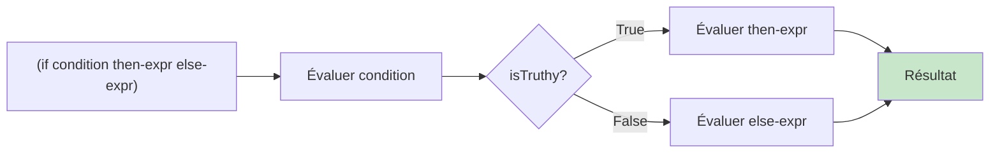

**Règles de "truthiness"** :
- `#f` → False
- `Nil` ou `()` → False
- Tout le reste → True

---

### 4.5 Gestion d'Erreurs

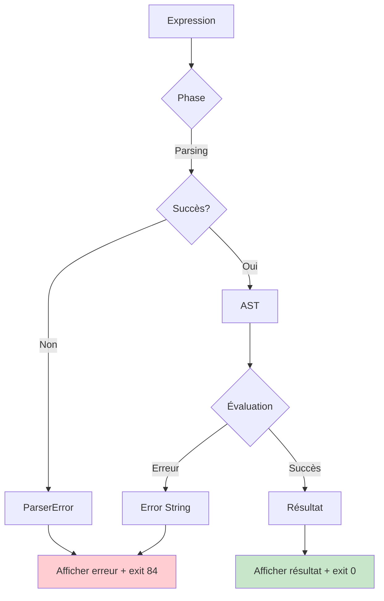

**Types d'erreurs** :
- **Parse errors** : Syntaxe invalide
- **Eval errors** : Variable non définie, type mismatch, arité incorrecte
- **Runtime errors** : Division par zéro, opérations invalides

---

## V. Notes sur l'Architecture Haskell

### 5.1 Choix de Paradigme Fonctionnel

#### Avantages pour un Interpréteur

1. **Immutabilité** : 
   - Les structures de données (AST, Env) ne sont jamais modifiées
   - Facilite le raisonnement et évite les bugs de mutation

2. **Récursion Naturelle** :
   - L'évaluation d'expressions imbriquées se fait naturellement par récursion
   - Pattern matching élégant sur `LispValue`

3. **Types Algébriques** :
   - `LispValue` et `LispFunction` capturent tous les cas possibles
   - Le compilateur garantit l'exhaustivité des cas

4. **Gestion d'Erreurs Explicite** :
   - `Either String a` rend les erreurs visibles dans les types
   - Propagation automatique via bind monadic (`>>=`)

---

### 5.2 Pattern Matching et Exhaustivité

```haskell
eval :: LispValue -> Env -> Either String (LispValue, Env)
eval (Number n) env = ...
eval (Boolean b) env = ...
eval (String s) env = ...
eval Nil env = ...
eval (Atom name) env = ...
eval (Function f) env = ...
eval (List []) env = ...
eval (List [Atom "if", c, t, e]) env = ...
eval (List [Atom "define", ...]) env = ...
-- etc.
```

**Avantage** : Le compilateur détecte les cas oubliés.

---

### 5.3 Monades et Effets

#### Either Monad pour Erreurs

```haskell
eval expr env >>= \(val, env') ->
evalArgs args env' >>= \(argVals, env'') ->
applyFunction func argVals env''
```

**Comportement** : Arrêt immédiat à la première erreur (short-circuit).

#### IO Monad pour Effets de Bord

```haskell
main :: IO ()
main = do
    input <- getContents          -- Effet IO
    case parseAndEval input of
        Left err -> putStrLn err  -- Effet IO
        Right result -> putStrLn result
```

**Séparation** : Le code pur (eval, parse) est séparé des IO.

---

### 5.4 Closures et Capture d'Environnement

```haskell
data LispFunction
    = UserFunction [String] LispValue Env
                   ^^^^^^^^           ^^^
                   Paramètres         Environnement capturé
```

**Exemple Lisp** :
```lisp
(define (make-adder n)
  (lambda (x) (+ x n)))    ; n capturé

(define add5 (make-adder 5))
(add5 10)  ; retourne 15
```

**Mécanique** :
- Lors de la création du lambda, `n` est dans l'environnement
- Le lambda capture cet environnement
- Lors de l'application, `n` est résolu dans l'environnement capturé

---

### 5.5 Récursion et Stack Safety

#### Problème
Haskell supporte la récursion infinie, mais l'interpréteur peut stack overflow.

```lisp
(define (infinite) (infinite))
(infinite)  ; Stack overflow!
```

#### Solution Actuelle
Pas d'optimisation TCO (Tail Call Optimization) implémentée.

#### Solution Future (Bonus)
Implémenter TCO pour les appels en position terminale :
```haskell
-- Détection de tail call
isTailCall :: LispValue -> Bool

-- Transformation en boucle itérative
evalTailRecursive :: ...
```

---

### 5.6 Performance et Lazy Evaluation

#### Lazy Evaluation de Haskell

Haskell évalue paresseusement par défaut, **mais** l'interpréteur Lisp est **strict**.

```lisp
(if #t 1 (infinite-loop))  ; Ne boucle pas, car else-branch pas évalué
```

**Implémentation** :
```haskell
evalIf condition thenExpr elseExpr env =
    eval condition env >>= \(condVal, env') ->
    if isTruthy condVal
        then eval thenExpr env'      -- Seulement then évalué
        else eval elseExpr env'      -- OU seulement else évalué
```

#### Optimisations Possibles

1. **Memoization** : Cache des résultats pour les définitions pures
2. **Strictness Analysis** : Forcer l'évaluation des thunks inutiles
3. **Inlining** : Substitution directe des petites fonctions

---

### 5.7 Types Fantômes et Safety

Haskell pourrait utiliser des **phantom types** pour plus de sécurité :

```haskell
-- Version actuelle
type Env = Env { bindings :: [(String, LispValue)], ... }

-- Version améliorée (future)
data ScopeType = Global | Local

data Env (s :: ScopeType) = Env {
    bindings :: [(String, LispValue)],
    parent :: Maybe (Env s)
}

-- Le système de types garantit qu'on ne mélange pas global/local
```

---

## VI. Considérations de Conception

### 6.1 Décisions d'Architecture Clés

#### 1. **Either vs Exceptions**
**Choix** : `Either String a` pour les erreurs  
**Raison** : Explicite, composable, compatible avec le paradigme fonctionnel

#### 2. **Environnement Chaîné vs Flat Map**
**Choix** : Chaînage avec `parent :: Maybe Env`  
**Raison** : Modélise naturellement le scoping lexical, facilite les closures

#### 3. **AST Unifié vs Typé**
**Choix** : `LispValue` unique pour tous les types  
**Raison** : Simplicité, reflète la nature dynamique du Lisp

#### 4. **Récursion Explicite vs Implicite**
**Choix** : Type `RecursiveFunction` distinct  
**Raison** : Permet l'auto-référence sans binder préalable

---

### 6.2 Évolutivité

#### Extensions Faciles

1. **Nouveaux Types** :
   ```haskell
   data LispValue = ... | Float Double | Symbol String | ...
   ```

2. **Nouvelles Builtins** :
   ```haskell
   newBuiltins = [("append", Function (BuiltinFunction "append" appendBuiltin))]
   ```

3. **Nouvelles Formes Spéciales** :
   ```haskell
   eval (List [Atom "let", ...]) env = evalLet ...
   ```

#### Extensions Difficiles

1. **Macros** : Nécessite un système de méta-programmation
2. **Continuations** : Requires CPS transformation
3. **Garbage Collection** : Haskell gère automatiquement, mais difficile d'exposer au Lisp

---

### 6.3 Points Forts de l'Architecture

✅ **Modularité** : Séparation claire des responsabilités  
✅ **Testabilité** : Fonctions pures faciles à tester unitairement  
✅ **Extensibilité** : Ajout de features sans refactoring massif  
✅ **Correction** : Types algébriques + pattern matching = moins de bugs  
✅ **Lisibilité** : Code déclaratif proche de la spécification  

---

### 6.4 Points d'Amélioration

⚠️ **Erreurs** : Messages d'erreur pourraient être plus détaillés (line numbers)  
⚠️ **Performance** : Pas d'optimisations (acceptable pour un interpréteur pédagogique)  
⚠️ **Macros** : Pas de système de macros (limitation du Lisp)  
⚠️ **Debugger** : Pas de support pour step-by-step debugging  
⚠️ **REPL complet** : Mode interactif simple, mais pas de features avancées (historique, auto-complétion)  

---

### 6.5 Comparaison avec d'Autres Interpréteurs

| Critère | GLaDOS (Haskell) | Python (C) | Ruby (C) | Scheme (R5RS) |
|---------|------------------|-----------|----------|---------------|
| **Paradigme** | Fonctionnel pur | Impératif OO | Impératif OO | Fonctionnel |
| **Immutabilité** | ✅ Par défaut | ❌ Mutable | ❌ Mutable | ✅ Par défaut |
| **Pattern Matching** | ✅ Natif | ❌ Simulé | ❌ Limité | ✅ Natif |
| **Gestion Erreurs** | `Either` | Exceptions | Exceptions | Conditions |
| **Performance** | Moyenne | Haute | Moyenne | Haute (compiled) |
| **Complexité Code** | Basse | Moyenne | Moyenne | Basse |

---

### 6.6 Leçons Apprises

#### Sur Haskell

1. **Types = Documentation** : Les signatures de types documentent le code
2. **Pureté = Testabilité** : Fonctions pures faciles à tester sans mocks
3. **Immutabilité = Sûreté** : Pas de bugs de mutation concurrente
4. **Lazy = Surprises** : Attention aux fuites mémoire avec thunks non évalués

#### Sur les Interpréteurs

1. **AST Central** : Tout tourne autour de la représentation de l'AST
2. **Environnement Clé** : La gestion du scope est critique
3. **Erreurs Explicites** : Meilleure UX avec messages d'erreur détaillés
4. **Récursion Omniprésente** : L'évaluation est intrinsèquement récursive

---

## VII. Diagrammes Additionnels

### 7.1 Vue Complète du Système

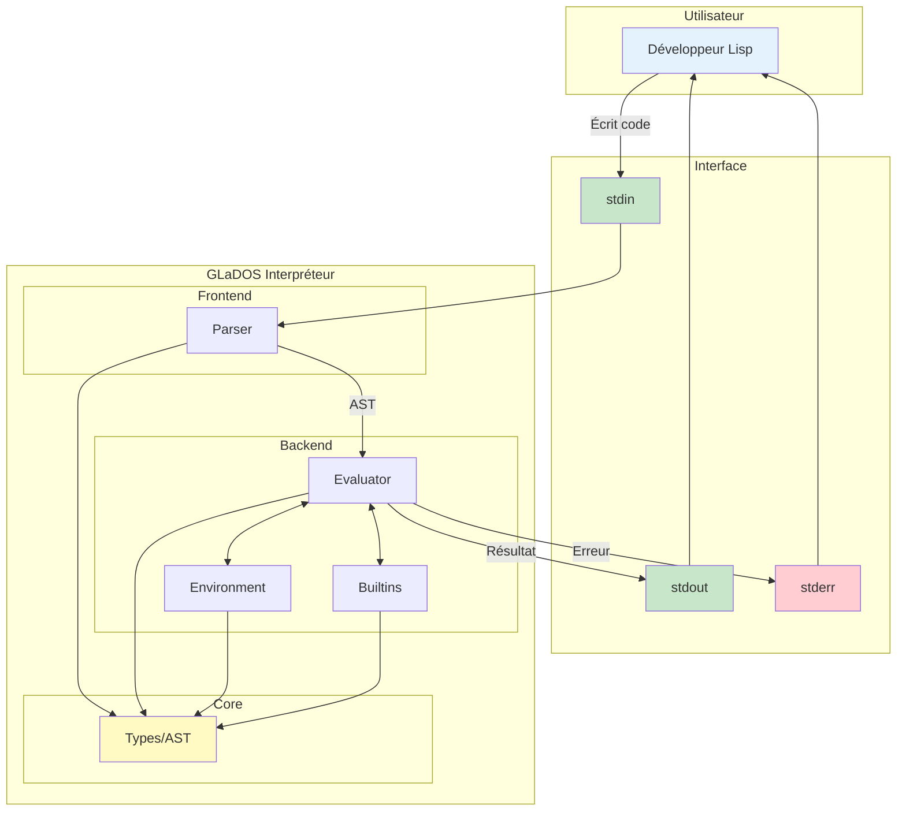

---

### 7.2 Cycle de Vie d'une Fonction Récursive

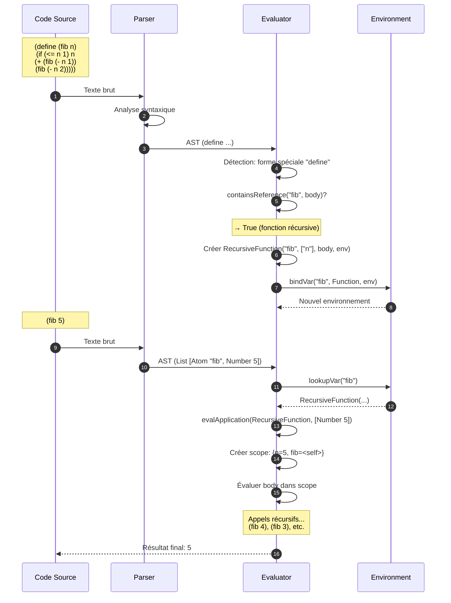

---

### 7.3 Hiérarchie des Types d'Erreurs

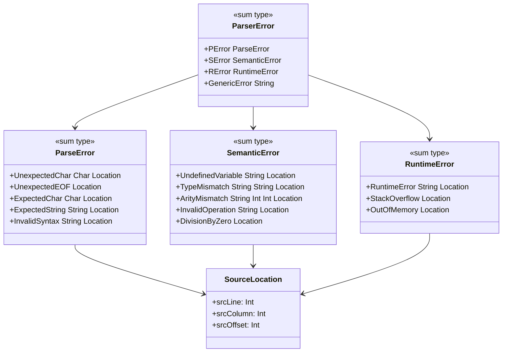

---

## VIII. Annexes

### 8.1 Glossaire

| Terme | Définition |
|-------|------------|
| **S-expression** | Expression symbolique du Lisp : `(fonction arg1 arg2)` |
| **AST** | Abstract Syntax Tree - représentation arborescente du code |
| **Binding** | Association nom ↔ valeur dans l'environnement |
| **Closure** | Fonction + environnement capturé |
| **Scoping Lexical** | Résolution des variables selon la structure du code |
| **Pattern Matching** | Déconstruction de structures de données selon leur forme |
| **Algebraic Data Type** | Type composé de plusieurs constructeurs (sum type) |
| **Monad** | Abstraction pour séquencer des calculs avec effets |

---

### 8.2 Références

1. **Structure and Interpretation of Computer Programs** (SICP)  
   Abelson & Sussman - Bible de la programmation Lisp

2. **Write Yourself a Scheme in 48 Hours**  
   Tutorial Haskell pour créer un interpréteur Scheme

3. **Real World Haskell**  
   O'Reilly - Guide pratique de Haskell

4. **Crafting Interpreters**  
   Robert Nystrom - Conception d'interpréteurs

---

### 8.3 Exemples de Code Complets

#### Exemple 1 : Factorial Récursif

```lisp
; Définition
(define (factorial n)
  (if (= n 0)
      1
      (* n (factorial (- n 1)))))

; Appel
(factorial 5)  ; => 120
```

**AST** :
```haskell
List [
  Atom "define",
  List [Atom "factorial", Atom "n"],
  List [Atom "if",
        List [Atom "=", Atom "n", Number 0],
        Number 1,
        List [Atom "*", Atom "n",
              List [Atom "factorial",
                    List [Atom "-", Atom "n", Number 1]]]]
]
```

#### Exemple 2 : Closure et Higher-Order Function

```lisp
; Créer un "adder"
(define (make-adder x)
  (lambda (y) (+ x y)))

; Utilisation
(define add5 (make-adder 5))
(add5 10)  ; => 15
(add5 20)  ; => 25
```

**Environnements** :
```
Global Env:
  make-adder -> UserFunction(["x"], lambda-expr, emptyEnv)
  add5 -> UserFunction(["y"], (+ x y), captured-env)
    où captured-env = {x: 5}
```

#### Exemple 3 : Manipulation de Listes

```lisp
; Définir une liste
(define mylist (list 1 2 3 4 5))

; Opérations
(car mylist)          ; => 1
(cdr mylist)          ; => (2 3 4 5)
(cons 0 mylist)       ; => (0 1 2 3 4 5)
```

---

### 8.4 Métriques du Projet

| Métrique | Valeur |
|----------|--------|
| **Modules** | 6 (Types, Parser, Eval, Env, Builtins, Main) |
| **Lignes de Code** | ~1200 LOC |
| **Fonctions Natives** | 14 builtins |
| **Types LispValue** | 7 constructeurs |
| **Types LispFunction** | 4 constructeurs |
| **Formes Spéciales** | 4 (if, define, lambda, quote) |
| **Complexité Cyclomatique** | ~3-5 par fonction (faible) |

---

## Conclusion

L'architecture de **GLaDOS** démontre comment les principes du paradigme fonctionnel (types algébriques, immutabilité, pureté) permettent de créer un interpréteur Lisp **clair**, **maintenable** et **extensible**.

La séparation modulaire entre **parsing**, **évaluation**, **environnement** et **builtins** facilite la compréhension et l'évolution du système. Les choix architecturaux (Either pour erreurs, environnements chaînés, AST unifié) équilibrent **simplicité** et **expressivité**.

Ce document sert de **référence technique** pour comprendre, maintenir et étendre l'interpréteur GLaDOS dans le cadre du projet pédagogique Epitech B-FUN-500.

---

**Document réalisé le 4 octobre 2025**  
*Projet GLaDOS - Interpréteur Lisp en Haskell*
