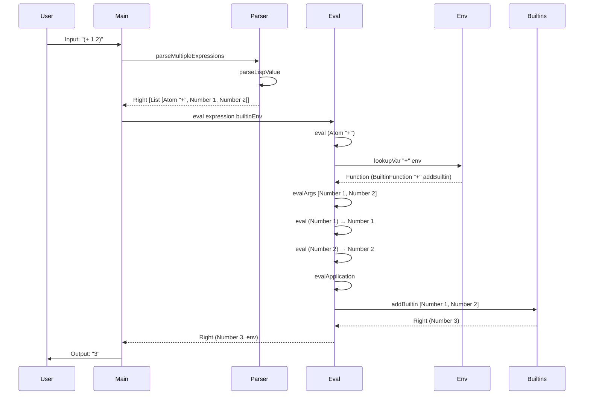
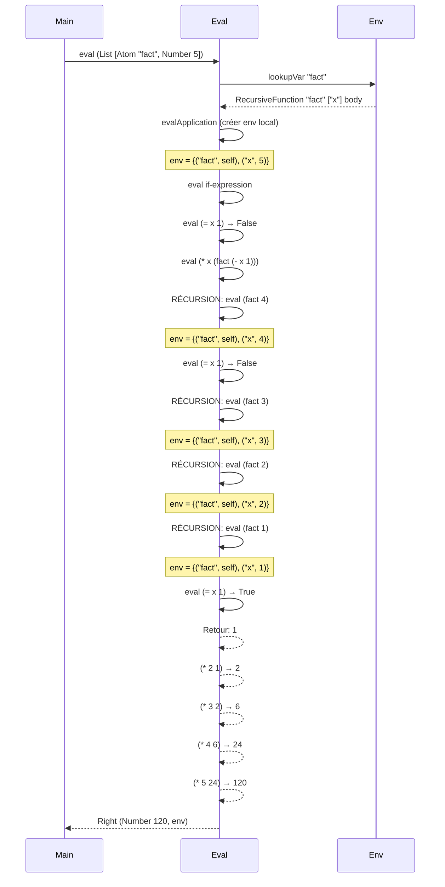
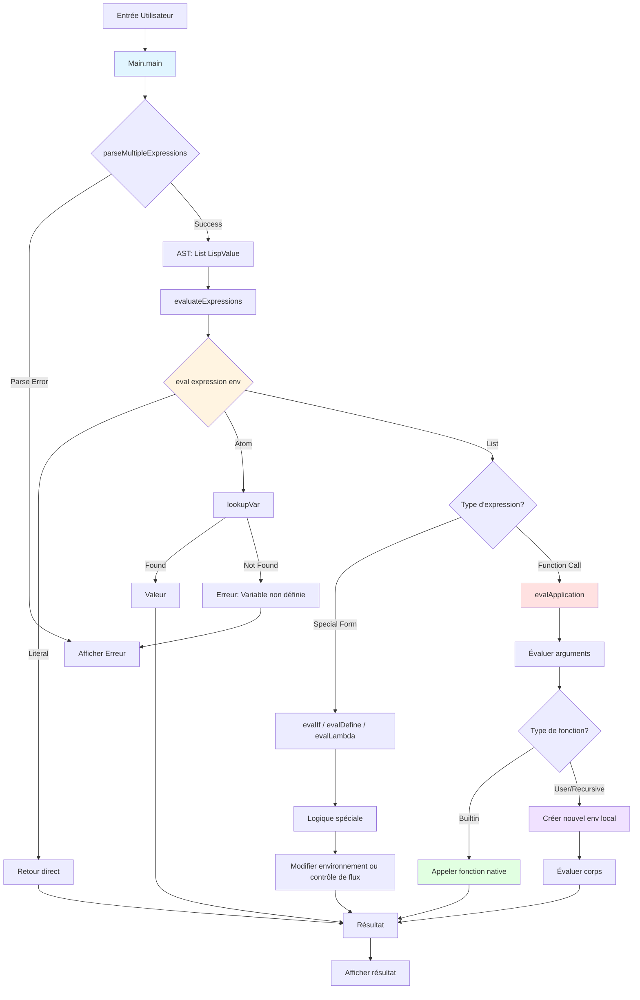
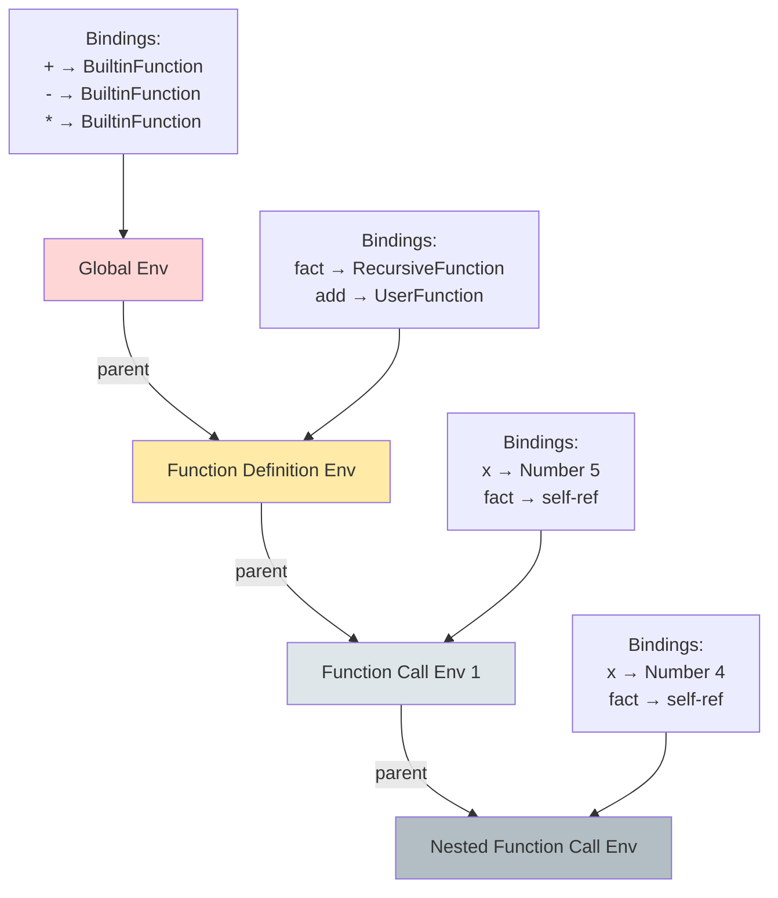

# Étude de cas et déroulement d'exécution – GLaDOS Lisp Interpreter

**Projet B-FUN-500 – GLaDOS**  
*Interpréteur Lisp minimaliste en Haskell – Epitech 2025*

---

## I. Introduction

### 🎯 Rôle du programme

GLaDOS est un interpréteur de Lisp minimaliste écrit en Haskell. Son rôle est de :

1. **Lire** du code Lisp depuis l'entrée standard
2. **Parser** les S-expressions pour construire un AST (Abstract Syntax Tree)
3. **Évaluer** le code de manière récursive dans un environnement
4. **Afficher** les résultats ou les messages d'erreur

### 🧩 Concepts clés

- **S-expressions** : Représentation syntaxique du Lisp sous forme de listes et d'atomes
- **AST (`LispValue`)** : Structure de données Haskell représentant les valeurs Lisp
- **Environnement (`Env`)** : Dictionnaire associant des noms de variables à des valeurs, avec support de la portée lexicale
- **Évaluation récursive** : Chaque expression est évaluée en fonction de sa structure, les sous-expressions étant évaluées récursivement
- **Fonctions natives** : Fonctions prédéfinies (+, -, *, car, cdr, etc.)
- **Fonctions utilisateur** : Fonctions définies via `lambda` ou `define`
- **Formes spéciales** : Constructions syntaxiques spéciales (`if`, `define`, `lambda`, `quote`) qui ne suivent pas les règles d'évaluation classiques

### 🍳 Analogie

Imaginez GLaDOS comme une cuisine professionnelle :

- Le **parser** est le chef qui lit la recette (code Lisp) et la décompose en instructions structurées (AST)
- L'**environnement** est le garde-manger contenant tous les ingrédients (variables) disponibles
- L'**évaluateur** est le cuisinier qui exécute les instructions de la recette, en utilisant les ingrédients du garde-manger
- Les **fonctions natives** sont les ustensiles de base (couteau, fouet, casserole)
- Les **fonctions utilisateur** sont des techniques culinaires personnalisées que le chef peut créer et réutiliser

Le résultat final est un plat délicieux (ou une erreur si quelque chose a mal tourné) !

---

## II. Cas pratiques d'exécution

### 📋 Cas 1 : Addition simple – `(+ 1 2)`

#### Code Lisp
```scheme
(+ 1 2)
```

#### Déroulement étape par étape

**1. Lecture et parsing (Main → Parser)**

```
main :: IO ()
  ↓
getContents  →  "(+ 1 2)"
  ↓
parseMultipleExpressions "(+ 1 2)"
  ↓
parseExpressionsParser
  ↓
parseLispValue
```

- La fonction `main` lit l'entrée standard avec `getContents`
- `parseMultipleExpressions` appelle le parser sur l'entrée
- Le parser identifie :
  - `(` → début de liste
  - `+` → atome (symbole)
  - `1` → nombre entier
  - `2` → nombre entier
  - `)` → fin de liste

**2. Construction de l'AST**

Le parser produit la structure suivante :
```haskell
List [Atom "+", Number 1, Number 2]
```

Type : `LispValue`

**3. Évaluation (Eval)**

```
eval (List [Atom "+", Number 1, Number 2]) builtinEnv
```

L'évaluateur détecte une liste et applique la logique suivante :

a. **Évaluation de la fonction** :
```haskell
eval (Atom "+") builtinEnv
  → lookupVar "+" builtinEnv
  → Just (Function (BuiltinFunction "+" addBuiltin))
```

b. **Évaluation des arguments** :
```haskell
evalArgs [Number 1, Number 2] builtinEnv
  → eval (Number 1) env → (Number 1, env)
  → eval (Number 2) env → (Number 2, env)
  → ([Number 1, Number 2], env)
```

c. **Application de la fonction** :
```haskell
evalApplication (Function (BuiltinFunction "+" addBuiltin))
                [Number 1, Number 2]
                builtinEnv
  ↓
addBuiltin [Number 1, Number 2]
  ↓
extractNumber (Number 1) → Right 1
extractNumber (Number 2) → Right 2
  ↓
sum [1, 2] = 3
  ↓
Right (Number 3)
```

**4. Affichage du résultat**

```
=> (+ 1 2)
3
```

#### Flux de données

```
Input: "(+ 1 2)"
  ↓ [Parser]
AST: List [Atom "+", Number 1, Number 2]
  ↓ [Eval - lookup "+"]
Function: BuiltinFunction "+" addBuiltin
  ↓ [Eval - evalArgs]
Args: [Number 1, Number 2]
  ↓ [Apply - addBuiltin]
Result: Number 3
  ↓ [Display]
Output: "3"
```

---

### 📋 Cas 2 : Définition de variable – `(define foo 42)`

#### Code Lisp
```scheme
(define foo 42)
```

#### Déroulement étape par étape

**1. Parsing**

Input : `"(define foo 42)"`
AST produit :
```haskell
List [Atom "define", Atom "foo", Number 42]
```

**2. Évaluation**

L'évaluateur reconnaît la forme spéciale `define` :

```haskell
eval (List [Atom "define", Atom "foo", Number 42]) env
```

Pattern matching sur :
```haskell
eval (List [Atom "define", Atom name, expr]) env
  → evalDefine "foo" (Number 42) env
```

**3. Évaluation de la définition**

```haskell
evalDefine "foo" (Number 42) env
  ↓
eval (Number 42) env
  → Right (Number 42, env)
  ↓
bindVar "foo" (Number 42) env
  → Env {bindings = [("foo", Number 42), ...], parent = Nothing}
```

La fonction `bindVar` ajoute la liaison `("foo", Number 42)` en tête de la liste des bindings de l'environnement.

**4. Résultat**

```
=> (define foo 42)
42
```

L'environnement est maintenant modifié :
```haskell
Env {
  bindings = [("foo", Number 42), ("+", Function ...), ...],
  parent = Nothing
}
```

**5. Utilisation ultérieure**

Si on évalue ensuite `foo` :
```haskell
eval (Atom "foo") env
  → lookupVar "foo" env
  → Just (Number 42)
  → Right (Number 42, env)
```

Output : `42`

---

### 📋 Cas 3 : Définition et appel de fonction – `(define (add a b) (+ a b))` puis `(add 3 4)`

#### Code Lisp
```scheme
(define (add a b) (+ a b))
(add 3 4)
```

#### Déroulement étape par étape

**Phase 1 : Définition de la fonction**

**1. Parsing de la définition**

Input : `"(define (add a b) (+ a b))"`

AST :
```haskell
List [
  Atom "define",
  List [Atom "add", Atom "a", Atom "b"],
  List [Atom "+", Atom "a", Atom "b"]
]
```

**2. Transformation syntaxique**

L'évaluateur détecte la forme spéciale de définition de fonction :
```haskell
eval (List [Atom "define", List (Atom name : params), body]) env
```

Il transforme cette expression en :
```haskell
eval (List [
  Atom "define",
  Atom "add",
  List [Atom "lambda", List [Atom "a", Atom "b"], List [Atom "+", Atom "a", Atom "b"]]
]) env
```

**3. Création de la lambda**

```haskell
evalDefine "add" 
           (List [Atom "lambda", List [Atom "a", Atom "b"], body])
           env
```

La fonction vérifie si le corps contient une référence récursive à `"add"` :
```haskell
containsReference "add" (List [Atom "+", Atom "a", Atom "b"])
  → False  -- Pas de récursion ici
```

Donc, on crée une `UserFunction` :
```haskell
UserFunction ["a", "b"] (List [Atom "+", Atom "a", Atom "b"]) env
```

**4. Liaison dans l'environnement**

```haskell
bindVar "add" (Function (UserFunction ["a", "b"] body env)) env
```

Environnement mis à jour :
```haskell
Env {
  bindings = [
    ("add", Function (UserFunction ["a", "b"] ...)),
    ("foo", Number 42),
    ("+", Function (BuiltinFunction "+" ...)),
    ...
  ],
  parent = Nothing
}
```

**Phase 2 : Appel de la fonction**

**1. Parsing de l'appel**

Input : `"(add 3 4)"`

AST :
```haskell
List [Atom "add", Number 3, Number 4]
```

**2. Évaluation**

```haskell
eval (List [Atom "add", Number 3, Number 4]) env
```

a. **Évaluation de la fonction** :
```haskell
eval (Atom "add") env
  → lookupVar "add" env
  → Just (Function (UserFunction ["a", "b"] body capturedEnv))
```

b. **Évaluation des arguments** :
```haskell
evalArgs [Number 3, Number 4] env
  → ([Number 3, Number 4], env)
```

c. **Application de la fonction utilisateur** :
```haskell
evalApplication (Function (UserFunction ["a", "b"] body capturedEnv))
                [Number 3, Number 4]
                env
```

Vérification de l'arité : 2 paramètres, 2 arguments ✓

**3. Création d'un nouvel environnement local**

```haskell
newScopeWith [("a", Number 3), ("b", Number 4)] capturedEnv
  → Env {
      bindings = [("a", Number 3), ("b", Number 4)],
      parent = Just capturedEnv
    }
```

**4. Évaluation du corps de la fonction**

```haskell
eval (List [Atom "+", Atom "a", Atom "b"]) localEnv
  ↓
eval (Atom "+") localEnv
  → lookupVar "+" localEnv
  → (dans parent) Function (BuiltinFunction "+" addBuiltin)
  ↓
evalArgs [Atom "a", Atom "b"] localEnv
  → eval (Atom "a") localEnv → Number 3
  → eval (Atom "b") localEnv → Number 4
  → ([Number 3, Number 4], localEnv)
  ↓
evalApplication (BuiltinFunction "+" addBuiltin) [Number 3, Number 4] localEnv
  → addBuiltin [Number 3, Number 4]
  → Right (Number 7)
```

**5. Résultat final**

```
=> (define (add a b) (+ a b))
<function:(a b)>

=> (add 3 4)
7
```

#### Concepts clés illustrés

- **Portée lexicale** : La fonction capture l'environnement au moment de sa création
- **Environnement local** : Un nouvel environnement est créé pour chaque appel de fonction
- **Chaînage d'environnements** : Les variables locales masquent les variables globales, mais on peut accéder aux variables du parent

---

### 📋 Cas 4 : Fonction récursive – Factorielle

#### Code Lisp
```scheme
(define (fact x)
  (if (= x 1)
      1
      (* x (fact (- x 1)))))
      
(fact 5)
```

#### Déroulement étape par étape

**Phase 1 : Définition de la fonction récursive**

**1. Parsing**

AST :
```haskell
List [
  Atom "define",
  List [Atom "fact", Atom "x"],
  List [
    Atom "if",
    List [Atom "=", Atom "x", Number 1],
    Number 1,
    List [Atom "*", Atom "x", List [Atom "fact", List [Atom "-", Atom "x", Number 1]]]
  ]
]
```

**2. Détection de la récursion**

```haskell
evalDefine "fact" lambdaExpr env
  ↓
containsReference "fact" body
  → True  -- "fact" apparaît dans le corps !
```

Création d'une `RecursiveFunction` :
```haskell
RecursiveFunction "fact" ["x"] body env
```

**3. Liaison dans l'environnement**

```haskell
bindVar "fact" (Function (RecursiveFunction "fact" ["x"] body env)) env
```

**Phase 2 : Appel initial – `(fact 5)`**

**1. Évaluation de l'appel**

```haskell
eval (List [Atom "fact", Number 5]) env
  ↓
eval (Atom "fact") env
  → Function (RecursiveFunction "fact" ["x"] body capturedEnv)
  ↓
evalArgs [Number 5] env
  → ([Number 5], env)
```

**2. Application de la fonction récursive**

```haskell
evalApplication (RecursiveFunction "fact" ["x"] body capturedEnv)
                [Number 5]
                env
```

Création de l'environnement local avec **auto-référence** :
```haskell
selfRef = Function (RecursiveFunction "fact" ["x"] body capturedEnv)
funcEnv = newScopeWith [
  ("fact", selfRef),  -- La fonction peut s'appeler elle-même !
  ("x", Number 5)
] capturedEnv
```

**3. Évaluation du corps (niveau 1)**

```haskell
eval ifExpression funcEnv
  ↓
evalIf (List [Atom "=", Atom "x", Number 1])
       (Number 1)
       (List [Atom "*", Atom "x", recursiveCall])
       funcEnv
```

a. **Évaluation de la condition** :
```haskell
eval (List [Atom "=", Atom "x", Number 1]) funcEnv
  → eqBuiltin [Number 5, Number 1]
  → Boolean False
```

b. **Branche else – évaluation de `(* x (fact (- x 1)))`** :
```haskell
eval (List [Atom "*", Atom "x", List [Atom "fact", ...]]) funcEnv
  ↓
eval (Atom "x") funcEnv → Number 5
  ↓
eval (List [Atom "fact", List [Atom "-", Atom "x", Number 1]]) funcEnv
  ↓
  eval (List [Atom "-", Atom "x", Number 1]) funcEnv
    → subBuiltin [Number 5, Number 1]
    → Number 4
  ↓
  eval (List [Atom "fact", Number 4]) funcEnv
    → APPEL RÉCURSIF avec x=4
```

**Phase 3 : Appels récursifs successifs**

| Niveau | Appel         | Condition  | Résultat partiel                |
|--------|---------------|------------|---------------------------------|
| 1      | `(fact 5)`    | `5 = 1`?   | Non → `(* 5 (fact 4))`          |
| 2      | `(fact 4)`    | `4 = 1`?   | Non → `(* 4 (fact 3))`          |
| 3      | `(fact 3)`    | `3 = 1`?   | Non → `(* 3 (fact 2))`          |
| 4      | `(fact 2)`    | `2 = 1`?   | Non → `(* 2 (fact 1))`          |
| 5      | `(fact 1)`    | `1 = 1`?   | **Oui** → `1` (cas de base)     |

**Phase 4 : Remontée et calcul final**

```
(fact 1) → 1
(fact 2) → (* 2 1) → 2
(fact 3) → (* 3 2) → 6
(fact 4) → (* 4 6) → 24
(fact 5) → (* 5 24) → 120
```

**Résultat final**

```
=> (define (fact x) ...)
<recursive-function:fact:(x)>

=> (fact 5)
120
```

#### Concepts clés illustrés

- **Récursion** : La fonction s'appelle elle-même
- **Auto-référence** : L'environnement local inclut la fonction elle-même
- **Condition de terminaison** : `(= x 1)` empêche la récursion infinie
- **Pile d'appels** : Chaque appel crée un nouvel environnement qui est empilé

---

### 📋 Cas 5 : Cas d'erreur – Variable non définie

#### Code Lisp
```scheme
(* foo 2)
```

(En supposant que `foo` n'a **pas** été défini précédemment)

#### Déroulement étape par étape

**1. Parsing**

AST :
```haskell
List [Atom "*", Atom "foo", Number 2]
```

**2. Évaluation**

```haskell
eval (List [Atom "*", Atom "foo", Number 2]) env
  ↓
eval (Atom "*") env
  → Right (Function (BuiltinFunction "*" mulBuiltin), env)
  ↓
evalArgs [Atom "foo", Number 2] env
  ↓
  eval (Atom "foo") env
    → lookupVar "foo" env
    → Nothing  -- Variable non trouvée !
    → Left "Undefined variable: foo"
```

**3. Propagation de l'erreur**

```haskell
evalArgs [Atom "foo", Number 2] env
  → Left "Undefined variable: foo"
  ↓
eval (List [Atom "*", Atom "foo", Number 2]) env
  → Left "Undefined variable: foo"
  ↓
evaluateExpressions
  → putStrLn "Eval Error: Undefined variable: foo"
```

**4. Affichage de l'erreur**

```
=> (* foo 2)
Eval Error: Undefined variable: foo
```

#### Concepts clés illustrés

- **Gestion d'erreurs avec `Either`** : Les erreurs sont propagées automatiquement grâce au type `Either String (LispValue, Env)`
- **Recherche de variable** : `lookupVar` parcourt la chaîne d'environnements
- **Messages d'erreur clairs** : L'utilisateur sait exactement quel symbole pose problème

---

### 📋 Cas 6 : Forme spéciale `if` – Conditionnelle

#### Code Lisp
```scheme
(if (< 3 5) "vrai" "faux")
```

#### Déroulement étape par étape

**1. Parsing**

AST :
```haskell
List [
  Atom "if",
  List [Atom "<", Number 3, Number 5],
  String "vrai",
  String "faux"
]
```

**2. Reconnaissance de la forme spéciale**

```haskell
eval (List [Atom "if", condition, thenExpr, elseExpr]) env
  → evalIf condition thenExpr elseExpr env
```

**3. Évaluation de la condition**

```haskell
evalIf (List [Atom "<", Number 3, Number 5])
       (String "vrai")
       (String "faux")
       env
  ↓
eval (List [Atom "<", Number 3, Number 5]) env
  → ltBuiltin [Number 3, Number 5]
  → Boolean True
```

**4. Choix de la branche**

```haskell
isTruthy (Boolean True) → True
  ↓
eval (String "vrai") env
  → Right (String "vrai", env)
```

**Résultat**

```
=> (if (< 3 5) "vrai" "faux")
"vrai"
```

**Si la condition était fausse** :
```scheme
(if (< 5 3) "vrai" "faux")
```

```haskell
ltBuiltin [Number 5, Number 3] → Boolean False
  ↓
isTruthy (Boolean False) → False
  ↓
eval (String "faux") env
  → Right (String "faux", env)
```

Output : `"faux"`

#### Concepts clés illustrés

- **Évaluation paresseuse** : Seule la branche choisie est évaluée (pas les deux !)
- **Formes spéciales** : `if` ne suit pas les règles normales d'évaluation des arguments
- **Truthiness** : Tout est vrai sauf `#f`, `()` et `nil`

---

## III. Analyse fonctionnelle

### 🔧 Fonction `main`

**Module** : `Main`

**Signature** :
```haskell
main :: IO ()
```

**Rôle** : Point d'entrée du programme. Orchestre la lecture de l'entrée, le parsing, l'évaluation et l'affichage des résultats.

**Effet** : 
- **Monade IO** : Effectue des entrées/sorties
- Lit l'entrée standard
- Affiche les résultats ou erreurs sur la sortie standard

**Flux** :
```
getContents
  ↓
parseMultipleExpressions
  ↓
evaluateExpressions
  ↓
putStrLn (résultats)
```

**Gestion d'erreurs** :
- Erreurs de parsing → affichage de `"Parse Error: ..."`
- Erreurs d'évaluation → affichage de `"Eval Error: ..."`

---

### 🔧 Fonction `parseMultipleExpressions`

**Module** : `Main`

**Signature** :
```haskell
parseMultipleExpressions :: String -> Either ParserError [LispValue]
```

**Entrée** : 
- `String` : Code Lisp brut

**Sortie** :
- `Left ParserError` : Erreur de parsing
- `Right [LispValue]` : Liste d'expressions parsées

**Rôle** : Parse plusieurs expressions Lisp séparées par des espaces/commentaires.

**Effet** : **Pur** (pas d'effets de bord)

**Détails** :
- Utilise `parseExpressionsParser` pour parser une séquence
- Gère les espaces et commentaires entre expressions
- Vérifie la fin de fichier avec `parseEOF`

---

### 🔧 Fonction `parseLispValue`

**Module** : `Parser`

**Signature** :
```haskell
parseLispValue :: Parser LispValue
```

**Entrée** : Implicite (état du parser sur la chaîne d'entrée)

**Sortie** : Un `Parser LispValue` (combinateur de parser)

**Rôle** : Parse une valeur Lisp unique (nombre, string, booléen, liste, atome).

**Effet** : **Pur**

**Stratégie** : Essaie les parsers dans l'ordre :
```haskell
parseNumber <|> parseString <|> parseBoolean <|> parseList <|> parseAtom
```

**Détails** :
- `<|>` : Opérateur de choix alternatif (try each in order)
- Si un parser échoue, essaie le suivant
- Retourne le premier qui réussit

---

### 🔧 Fonction `eval`

**Module** : `Eval`

**Signature** :
```haskell
eval :: LispValue -> Env -> Either String (LispValue, Env)
```

**Entrée** :
- `LispValue` : Expression à évaluer
- `Env` : Environnement courant

**Sortie** :
- `Left String` : Erreur d'évaluation avec message
- `Right (LispValue, Env)` : Résultat et nouvel environnement

**Rôle** : Évalue une expression Lisp de manière récursive.

**Effet** : **Pur** (mais retourne un nouvel environnement modifié)

**Logique par pattern matching** :

| Pattern | Action |
|---------|--------|
| `Number n` | Retourne le nombre tel quel |
| `Boolean b` | Retourne le booléen tel quel |
| `String s` | Retourne la chaîne telle quelle |
| `Nil` | Retourne `Nil` |
| `Atom name` | Lookup de la variable dans l'environnement |
| `Function f` | Retourne la fonction telle quelle |
| `List []` | Liste vide → `Nil` |
| `List [Atom "if", ...]` | Forme spéciale `if` |
| `List [Atom "define", ...]` | Forme spéciale `define` |
| `List [Atom "lambda", ...]` | Forme spéciale `lambda` |
| `List [Atom "quote", ...]` | Forme spéciale `quote` |
| `List (f:args)` | Application de fonction |

---

### 🔧 Fonction `evalIf`

**Module** : `Eval`

**Signature** :
```haskell
evalIf :: LispValue -> LispValue -> LispValue -> Env -> Either String (LispValue, Env)
```

**Entrée** :
- `condition` : Expression de condition
- `thenExpr` : Expression à évaluer si vrai
- `elseExpr` : Expression à évaluer si faux
- `Env` : Environnement

**Sortie** : `Either String (LispValue, Env)`

**Rôle** : Implémente la conditionnelle `if`.

**Effet** : **Pur**

**Flux** :
```
1. Évalue la condition
2. Teste isTruthy sur le résultat
3. Évalue thenExpr ou elseExpr selon le résultat
```

**Caractéristique importante** : Évaluation **paresseuse** – seule la branche choisie est évaluée !

---

### 🔧 Fonction `evalDefine`

**Module** : `Eval`

**Signature** :
```haskell
evalDefine :: String -> LispValue -> Env -> Either String (LispValue, Env)
```

**Entrée** :
- `String` : Nom de la variable/fonction
- `LispValue` : Expression à définir
- `Env` : Environnement

**Sortie** : `Either String (LispValue, Env)`

**Rôle** : Définit une variable ou une fonction dans l'environnement.

**Effet** : **Modifie l'environnement** (retourne un nouvel environnement avec la liaison ajoutée)

**Cas particulier** : Détection automatique de la récursion :
```haskell
if containsReference name body
    then RecursiveFunction ...
    else UserFunction ...
```

---

### 🔧 Fonction `evalApplication`

**Module** : `Eval`

**Signature** :
```haskell
evalApplication :: LispValue -> [LispValue] -> Env -> Either String (LispValue, Env)
```

**Entrée** :
- `LispValue` : La fonction à appliquer
- `[LispValue]` : Les expressions arguments (non évaluées)
- `Env` : Environnement

**Sortie** : `Either String (LispValue, Env)`

**Rôle** : Applique une fonction à ses arguments.

**Effet** : **Pur**

**Logique par type de fonction** :

1. **BuiltinFunction** :
   - Évalue tous les arguments
   - Appelle la fonction native
   
2. **UserFunction** :
   - Évalue tous les arguments
   - Crée un nouvel environnement local avec les paramètres liés aux valeurs
   - Évalue le corps dans cet environnement

3. **RecursiveFunction** :
   - Comme `UserFunction`, mais ajoute une auto-référence dans l'environnement

---

### 🔧 Fonction `lookupVar`

**Module** : `Env`

**Signature** :
```haskell
lookupVar :: String -> Env -> Maybe LispValue
```

**Entrée** :
- `String` : Nom de la variable
- `Env` : Environnement de recherche

**Sortie** :
- `Just LispValue` : Valeur trouvée
- `Nothing` : Variable non définie

**Rôle** : Recherche une variable dans la chaîne d'environnements (portée lexicale).

**Effet** : **Pur** (lecture seule)

**Algorithme** :
```
1. Cherche dans les bindings de l'environnement courant
2. Si trouvé → retourne la valeur
3. Sinon, cherche récursivement dans le parent
4. Si aucun parent → retourne Nothing
```

---

### 🔧 Fonction `bindVar`

**Module** : `Env`

**Signature** :
```haskell
bindVar :: String -> LispValue -> Env -> Env
```

**Entrée** :
- `String` : Nom de la variable
- `LispValue` : Valeur à associer
- `Env` : Environnement

**Sortie** : `Env` (nouvel environnement)

**Rôle** : Ajoute une nouvelle liaison variable/valeur dans l'environnement.

**Effet** : **Pur** (retourne un nouvel environnement, ne modifie pas l'ancien)

**Implémentation** :
```haskell
Env ((name, value) : bindings) parent
```

Ajoute la liaison en tête de liste (masquage des variables de même nom).

---

### 🔧 Fonction `newScopeWith`

**Module** : `Env`

**Signature** :
```haskell
newScopeWith :: [(String, LispValue)] -> Env -> Env
```

**Entrée** :
- `[(String, LispValue)]` : Liaisons initiales
- `Env` : Environnement parent

**Sortie** : `Env` (nouvel environnement enfant)

**Rôle** : Crée un nouvel environnement local (pour les appels de fonctions).

**Effet** : **Pur**

**Structure** :
```haskell
Env bindings (Just parent)
```

L'environnement créé a accès aux variables du parent via le chaînage.

---

### 🔧 Fonctions natives (Builtins)

**Module** : `Builtins`

Exemples : `addBuiltin`, `subBuiltin`, `carBuiltin`, etc.

**Signature générale** :
```haskell
functionBuiltin :: [LispValue] -> Either String LispValue
```

**Entrée** : Liste de valeurs Lisp (arguments déjà évalués)

**Sortie** :
- `Left String` : Erreur (mauvais type, mauvaise arité, etc.)
- `Right LispValue` : Résultat

**Rôle** : Implémentent les opérations primitives du langage.

**Effet** : **Pur**

**Exemples** :

**`addBuiltin`** :
```haskell
addBuiltin :: [LispValue] -> Either String LispValue
addBuiltin [] = Right (Number 0)
addBuiltin args = Number . sum <$> mapM extractNumber args
```
- Accepte 0+ arguments
- Somme tous les nombres
- Retourne une erreur si un argument n'est pas un nombre

**`carBuiltin`** :
```haskell
carBuiltin :: [LispValue] -> Either String LispValue
carBuiltin [List (x:_)] = Right x
carBuiltin [List []] = Left "car: cannot take car of empty list"
```
- Accepte exactement 1 argument (une liste)
- Retourne le premier élément
- Erreur si liste vide ou argument invalide

---

## IV. Diagrammes d'exécution

### 📊 Diagramme 1 : Flot général d'exécution



---

### 📊 Diagramme 2 : Exécution de `(fact 5)` (factorielle récursive)



---

### 📊 Diagramme 3 : Structure de l'interpréteur (vue d'ensemble)



---

### 📊 Diagramme 4 : Environnement et portée lexicale



Lors de `lookupVar "x"` dans l'environnement `D` :
1. Cherche dans `D` → trouvé `x = 4`
2. Si non trouvé, cherche dans `C`, puis `B`, puis `A`
3. Retourne `Nothing` si jamais trouvé

---

### 📊 Diagramme 5 : Parser – Construction de l'AST

```mermaid
graph LR
    A["Input: '(+ 1 2)'"] --> B[parseChar '(']
    B --> C[parseWhitespace]
    C --> D[parseLispValue]
    
    D --> E[parseAtom]
    E --> F[Atom '+']
    
    D --> G[parseNumber]
    G --> H[Number 1]
    
    D --> I[parseNumber]
    I --> J[Number 2]
    
    J --> K[parseWhitespace]
    K --> L[parseChar ')']
    
    F --> M[List [Atom '+', Number 1, Number 2]]
    H --> M
    J --> M
    
    style M fill:#a8e6cf
```

---

## V. Conclusion

### 🎯 Points forts de la structure d'exécution

#### 1. **Séparation claire des responsabilités**

Le projet GLaDOS démontre une architecture modulaire exemplaire :

- **Parser** (`Parser.hs`) : Se concentre uniquement sur la transformation de texte en AST
- **Evaluator** (`Eval.hs`) : Gère la sémantique et l'exécution
- **Environment** (`Env.hs`) : Encapsule la gestion des variables et de la portée
- **Builtins** (`Builtins.hs`) : Regroupe toutes les fonctions natives
- **Types** (`Types.hs`) : Définit les structures de données communes

Cette séparation facilite la maintenance, l'évolution et le débogage du code.

#### 2. **Pureté fonctionnelle et usage judicieux de la monade IO**

L'essentiel du code est **pur** :
- Le parser retourne `Either ParserError [LispValue]`
- L'évaluateur retourne `Either String (LispValue, Env)`
- Les fonctions natives retournent `Either String LispValue`

Seul `Main.main` utilise la monade `IO` pour les entrées/sorties, ce qui rend le code :
- **Facile à tester** : Les fonctions pures peuvent être testées sans effets de bord
- **Facile à raisonner** : Le comportement est déterministe
- **Composable** : Les fonctions peuvent être combinées facilement

#### 3. **Simplicité de l'évaluation récursive**

L'évaluateur utilise le **pattern matching** de Haskell pour gérer élégamment tous les cas :

```haskell
eval (Number n) env = Right (Number n, env)
eval (Atom name) env = ...
eval (List [Atom "if", ...]) env = ...
eval (List (f:args)) env = ...
```

Cette approche rend le code :
- **Lisible** : Chaque cas est clairement identifié
- **Extensible** : Ajouter une nouvelle forme spéciale est trivial
- **Robuste** : Le pattern matching exhaustif garantit que tous les cas sont couverts

#### 4. **Gestion naturelle des erreurs avec `Either`**

L'utilisation du type `Either String (LispValue, Env)` permet :
- **Propagation automatique** : Les erreurs remontent naturellement grâce aux monades
- **Messages clairs** : Chaque erreur contient une description lisible
- **Pas d'exceptions** : Pas de crash inattendu, tout est géré de manière fonctionnelle

#### 5. **Support de la portée lexicale**

L'environnement chaîné (`parent :: Maybe Env`) implémente la portée lexicale :
- Les **closures** capturent leur environnement de définition
- Les **variables locales** masquent les globales
- La **recherche récursive** dans la chaîne d'environnements est efficace

#### 6. **Support élégant de la récursion**

La distinction entre `UserFunction` et `RecursiveFunction` permet :
- **Détection automatique** : `containsReference` détecte si une fonction s'appelle
- **Auto-référence** : L'environnement local inclut la fonction elle-même
- **Pas de syntaxe spéciale** : Le programmeur n'a pas à déclarer explicitement la récursion

### 🧪 Testabilité

Le code est hautement testable grâce à :

1. **Fonctions pures** : Tests déterministes sans mock
2. **Types algébriques** : Facile de construire des cas de test
3. **Séparation Parser/Eval** : Tests unitaires indépendants possibles
4. **Gestion d'erreurs explicite** : Tests des cas d'erreur naturels

Exemple de test possible :
```haskell
testAddition = 
    let env = builtinEnv
        expr = List [Atom "+", Number 1, Number 2]
    in eval expr env == Right (Number 3, env)
```

### 🔧 Modularité

L'architecture permet facilement :

- **Ajout de nouvelles formes spéciales** : Un pattern dans `eval`
- **Ajout de fonctions natives** : Une fonction dans `Builtins.hs`
- **Extension du parser** : Ajout de nouvelles syntaxes (ex: quotes `'expr`)
- **Changement de backend** : L'AST est indépendant du parser/evaluator

### 🚀 Évolutions possibles

Cette base solide permettrait d'ajouter :

1. **Macros** : Transformation de code avant évaluation
2. **Modules** : Système d'import/export
3. **Types statiques** : Vérification de types à la compilation
4. **Optimisations** : Tail-call optimization, memoization
5. **Garbage collection** : Gestion automatique de la mémoire pour les closures
6. **REPL interactif** : Boucle lecture-évaluation-affichage
7. **Débogueur** : Traçage des appels, breakpoints
8. **Bibliothèque standard** : Plus de fonctions natives

### 📚 Conclusion finale

Le projet **GLaDOS** est un excellent exemple d'interpréteur fonctionnel :

✅ **Architecture claire et modulaire**  
✅ **Code pur et testable**  
✅ **Gestion d'erreurs robuste**  
✅ **Support complet des fonctionnalités Lisp de base**  
✅ **Code idiomatique Haskell**  
✅ **Extensible et maintenable**

Ce projet démontre une compréhension solide des concepts de :
- Parsing et construction d'AST
- Évaluation de langages de programmation
- Environnements et portée lexicale
- Programmation fonctionnelle en Haskell
- Récursion et closures

C'est un fondement solide qui pourrait être étendu en un interpréteur Lisp complet et performant ! 🎉

---

**Auteur** : Documentation générée pour le projet B-FUN-500 – GLaDOS  
**Date** : Octobre 2025  
**Technologies** : Haskell, Lisp, Functional Programming
